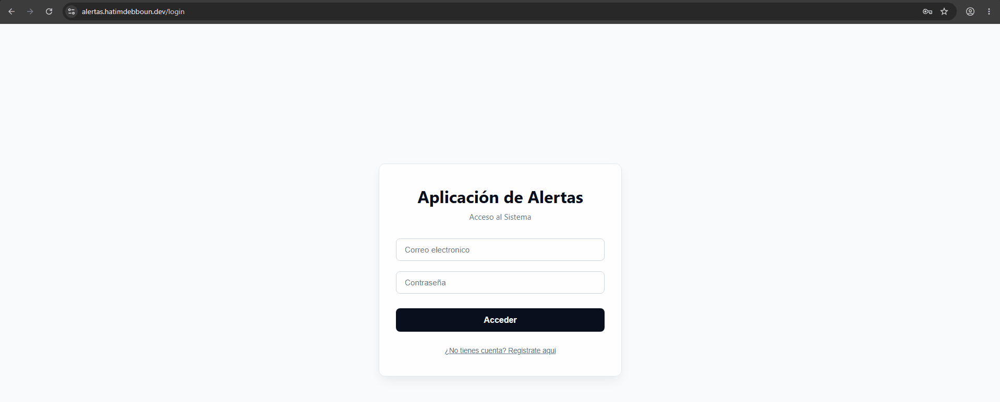
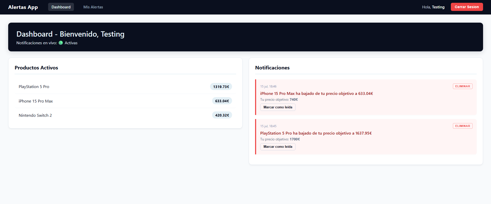
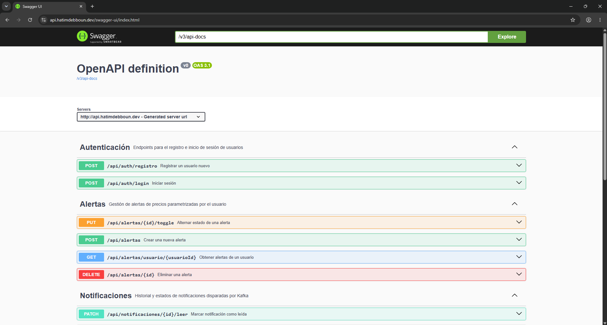

[](README.md) [](#)

---

# Sistema de Alertas de Precios en Tiempo Real

[](https://openjdk.org/projects/jdk/21/)
[](https://spring.io/projects/spring-boot)
[](https://kafka.apache.org/)
[](https://react.dev/)
[](https://www.docker.com/)
[]()
[]()
[](https://github.com/DebHatim/alertas-tiempo-real/actions/workflows/ci.yml)
[](https://hatimdebboun.dev)

Plataforma donde los usuarios configuran alertas personalizadas sobre productos y reciben notificaciones en tiempo real
cuando el precio baja de su objetivo. Arquitectura orientada a eventos con Apache Kafka como núcleo del sistema,
autenticación stateless con JWT y notificaciones push vía WebSocket.

---

## Demo



*Crear una alerta y luego ver la notificación llegar en tiempo real a través de WebSocket en el momento en que el precio
simulado cae por debajo del objetivo, sin actualizar la página.*

## Arquitectura


Autenticación: el login emite un JWT firmado (HS256) que el frontend adjunta en cada petición. Un filtro (
`JwtAuthenticationFilter`) valida el token y expone el id del usuario autenticado a los controladores. Las rutas de
alertas y notificaciones comprueban que el recurso solicitado pertenece al usuario del token, no al id que venga en la
URL.

## Stack

| Capa              | Tecnología                                                                 |
|-------------------|----------------------------------------------------------------------------|
| Backend           | Java 21 · Spring Boot 3.5                                                  |
| Mensajería        | Apache Kafka · Zookeeper                                                   |
| Seguridad         | Spring Security 6 · JWT (JJWT) · BCrypt · Rate limiting (Bucket4j)         |
| Persistencia      | JPA/Hibernate · MySQL 8                                                    |
| Tiempo real       | WebSocket · STOMP · SockJS                                                 |
| Documentación API | springdoc-openapi (Swagger UI)                                             |
| Observabilidad    | Spring Boot Actuator (health checks)                                       |
| Frontend          | React 19 · React Router · Axios                                            |
| Infraestructura   | Docker Compose (MySQL, Kafka, Zookeeper, backend, frontend, phpMyAdmin)    |
| CI/CD             | GitHub Actions (pruebas automatizadas + despliegue en cada envío a `main`) |
| Build             | Maven · Lombok                                                             |

## Funcionalidades

- Registro y login con JWT, contraseñas cifradas con BCrypt
- Autorización a nivel de recurso: cada usuario solo puede ver/modificar sus propias alertas y notificaciones
- Rate limiting en el endpoint de login para mitigar intentos de fuerza bruta
- Gestión de alertas por producto y precio objetivo (crear, pausar/reactivar, eliminar)
- Simulador de cambios de precio con variación aleatoria cada 5 segundos
- Evaluación de alertas en tiempo real mediante consumidor Kafka
- Notificaciones instantáneas al dashboard vía WebSocket, con opción de marcarlas como leídas
- Historial de notificaciones por usuario
- Documentación de API interactiva vía Swagger UI
- Endpoint de health check usado por Docker Compose para ordenar el arranque de servicios
- Despliegue en vivo con entrega continua: cada envío a `main` se prueba y se despliega automáticamente mediante GitHub
  Actions.
- Landing pública + flujo de login/registro separado del área privada

## Capturas de pantalla

<table>
  <tr>
    <td style="width: 50%; text-align: center;">
      
      <p><em>Panel de control: productos activos y flujo de notificaciones en tiempo real</em></p>
    </td>
    <td style="width: 50%; text-align: center;">
      
      <p><em>Página de alertas: crear, pausar/reanudar y eliminar alertas de precios</em></p>
    </td>
  </tr>
</table>

## Decisiones de diseño

**¿Por qué Kafka y no una llamada directa entre servicios?**
El desacoplamiento permite que el simulador y el evaluador evolucionen de forma independiente. Si el evaluador se cae,
los eventos se acumulan en Kafka y se procesan cuando vuelve, sin perder ninguno.

**¿Por qué WebSocket y no polling?**
El polling requeriría que el cliente pregunte cada X segundos si hay notificaciones nuevas, generando carga innecesaria.
WebSocket mantiene una conexión abierta y el servidor empuja las notificaciones en el momento exacto en que ocurren.

**¿Por qué JWT y no sesiones?**
El backend es completamente stateless: no guarda sesión en memoria ni en BD, lo que facilita escalar horizontalmente y
encaja de forma natural con un despliegue en contenedores separados de frontend y backend.

**¿Por qué una alerta se desactiva tras dispararse?**
Igual que en trackers de precio conocidos (Keepa, CamelCamelCamel), una alerta representa un objetivo puntual: en cuanto
se cumple, se marca como completada en vez de seguir notificando en bucle. El usuario puede reactivarla con un clic si
quiere seguir vigilando el mismo producto.

**¿Por qué rate limiting solo en login?**
Es el endpoint de mayor valor para ataques de fuerza bruta o credential stuffing contra cuentas de usuario. Bucket4j
limita los intentos repetidos por IP sin añadir overhead al resto de la API.

**¿Por qué una pipeline de CI/CD para un proyecto personal?**
Porque escribir pruebas solo sirve a medias si nadie impide que el código defectuoso llegue a producción.
Cada push ejecuta primero el conjunto completo de pruebas y solo si todo va bien, la canalización se conecta al servidor
mediante SSH, descarga el código más reciente y reconstruye los contenedores. Sin despliegues manuales, sin riesgo de
distribuir accidentalmente algo sin probar.

## Probarlo en local

**Requisito único:** tener Docker instalado.

```bash
git clone https://github.com/DebHatim/alertas-tiempo-real.git
cd alertas-tiempo-real
docker compose up -d
```

Ese único comando levanta MySQL, Zookeeper, Kafka, el backend Spring Boot y el frontend. Sin necesidad de instalar Java,
Maven, Node ni configurar bases de datos a mano.

- Frontend: `http://localhost`
- Backend API: `http://localhost:8080/api`
- Swagger UI: `http://localhost:8080/swagger-ui.html`
- Health check del backend: `http://localhost:8080/actuator/health`
- phpMyAdmin (opcional, inspeccionar BD): `http://localhost:8081`

> MySQL corre sin contraseña y phpMyAdmin con acceso arbitrario, una configuración pensada solo para desarrollo local,
> no para un despliegue expuesto a internet.

<details>
<summary>Desarrollo del backend sin Docker (opcional)</summary>

Si quieres iterar directamente sobre el backend con Maven, necesitas Java 21, Maven, y una instancia de Kafka + MySQL 8
corriendo por tu cuenta (puedes levantar solo esas dos con `docker compose up -d mysql kafka zookeeper`).

```bash
./mvnw spring-boot:run
```

Y para el frontend:

```bash
cd frontend-alertas
npm install
npm run dev
```

Variables de entorno relevantes: `KAFKA_SERVERS`, `DB_URL`, `DB_USERNAME`, `DB_PASSWORD`, `APP_CORS_ALLOWED_ORIGIN` (
backend) y `VITE_API_URL` (frontend, build-time).
</details>

## Testing

Cobertura completa con **JUnit 5 + Mockito** sobre la lógica de negocio, sin infraestructura externa (no requiere Kafka
ni MySQL levantados):

- `AlertaServiceTest` - creación de alertas, listado por usuario, y control de propiedad al desactivar/eliminar (incluye
  el caso de un usuario intentando modificar una alerta que no es suya)
- `AlertaEvaluadorServiceTest` - lógica del consumidor de Kafka y disparo de alertas contra el precio objetivo
- `NotificacionServiceTest` - despacho de alertas en tiempo real: persistencia del historial en base de datos,
  validación de lectura/autorización de propiedad, y envío reactivo mediante WebSockets
- Tests de la capa de controllers para `AlertaController`, `NotificacionController`, `AuthController` y
  `ProductoController`

```bash
./mvnw test
```

Cada push a `main` y cada pull request ejecuta la suite completa vía GitHub Actions. Si las pruebas fallan, el
despliegue se omite automáticamente.

<details>
<summary>Capturas técnicas</summary>
<br>

<table>
  <tr>
    <td style="width: 33%; text-align: center;">
      
      <p><em>Suite de pruebas ejecutada con éxito</em></p>
    </td>
    <td style="width: 33%; text-align: center;">
      
      <p><em>Respuesta 429 de límite de peticiones tras intentos de login repetidos</em></p>
    </td>
    <td style="width: 33%; text-align: center;">
      
      <p><em>API documentada y explorable a través de Swagger UI</em></p>
    </td>
  </tr>
  <tr>
    <td colspan="3" style="text-align: center;">
      
      <p><em>El sistema entero arrancando con un simple <code>docker compose up -d</code></em></p>
    </td>
  </tr>
</table>

</details>

## Autor

**Hatim Debboun
** · [Portfolio](https://hatimdebboun.dev) · [LinkedIn](https://linkedin.com/in/hatimdebboun) · [GitHub](https://github.com/DebHatim)