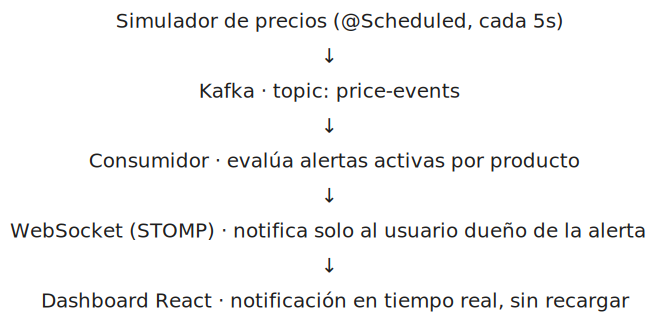

# Sistema de Alertas de Precios en Tiempo Real

[](https://openjdk.org/projects/jdk/21/)
[](https://spring.io/projects/spring-boot)
[](https://kafka.apache.org/)
[](https://react.dev/)
[](https://www.docker.com/)
[]()

Plataforma donde los usuarios configuran alertas personalizadas sobre productos y reciben notificaciones en tiempo real cuando el precio baja de su objetivo. Arquitectura orientada a eventos con Apache Kafka como núcleo del sistema, autenticación stateless con JWT y notificaciones push vía WebSocket.

---

## Arquitectura



Autenticación: el login emite un JWT firmado (HS256) que el frontend adjunta en cada petición. Un filtro (`JwtAuthenticationFilter`) valida el token y expone el id del usuario autenticado a los controladores. Las rutas de alertas y notificaciones comprueban que el recurso solicitado pertenece al usuario del token, no al id que venga en la URL.

## Stack

| Capa | Tecnología |
|------|-----------|
| Backend | Java 21 · Spring Boot 3.5 |
| Mensajería | Apache Kafka · Zookeeper |
| Seguridad | Spring Security 6 · JWT (JJWT) · BCrypt |
| Persistencia | JPA/Hibernate · MySQL 8 |
| Tiempo real | WebSocket · STOMP · SockJS |
| Frontend | React 19 · React Router · Axios |
| Infraestructura | Docker Compose (MySQL, Kafka, Zookeeper, backend, frontend, phpMyAdmin) |
| Build | Maven · Lombok |

## Funcionalidades

- Registro y login con JWT, contraseñas cifradas con BCrypt
- Autorización a nivel de recurso: cada usuario solo puede ver/modificar sus propias alertas y notificaciones
- Gestión de alertas por producto y precio objetivo (crear, pausar/reactivar, eliminar)
- Simulador de cambios de precio con variación aleatoria cada 5 segundos
- Evaluación de alertas en tiempo real mediante consumidor Kafka
- Notificaciones instantáneas al dashboard vía WebSocket, con opción de marcarlas como leídas
- Historial de notificaciones por usuario
- Landing pública + flujo de login/registro separado del área privada

## Decisiones de diseño

**¿Por qué Kafka y no una llamada directa entre servicios?**
El desacoplamiento permite que el simulador y el evaluador evolucionen de forma independiente. Si el evaluador se cae, los eventos se acumulan en Kafka y se procesan cuando vuelve, sin perder ninguno.

**¿Por qué WebSocket y no polling?**
El polling requeriría que el cliente pregunte cada X segundos si hay notificaciones nuevas, generando carga innecesaria. WebSocket mantiene una conexión abierta y el servidor empuja las notificaciones en el momento exacto en que ocurren.

**¿Por qué JWT y no sesiones?**
El backend es completamente stateless: no guarda sesión en memoria ni en BD, lo que facilita escalar horizontalmente y encaja de forma natural con un despliegue en contenedores separados de frontend y backend.

**¿Por qué una alerta se desactiva tras dispararse?**
Igual que en trackers de precio conocidos (Keepa, CamelCamelCamel), una alerta representa un objetivo puntual: en cuanto se cumple, se marca como completada en vez de seguir notificando en bucle. El usuario puede reactivarla con un clic si quiere seguir vigilando el mismo producto.

## Probarlo en local

**Requisito único:** tener Docker instalado.

```bash
git clone https://github.com/DebHatim/alertas-tiempo-real.git
cd alertas-tiempo-real
docker compose up -d
```

Ese único comando levanta MySQL, Zookeeper, Kafka, el backend Spring Boot y el frontend. Sin necsidad de instalar Java, Maven, Node ni configurar bases de datos a mano.

- Frontend: `http://localhost`
- Backend API: `http://localhost:8080/api`
- phpMyAdmin (opcional, inspeccionar BD): `http://localhost:8081`

> MySQL corre sin contraseña y phpMyAdmin con acceso arbitrario, una configuración pensada solo para desarrollo local, no para un despliegue expuesto a internet.

<details>
<summary>Desarrollo del backend sin Docker (opcional)</summary>

Si quieres iterar directamente sobre el backend con Maven, necesitas Java 21, Maven, y una instancia de Kafka + MySQL 8 corriendo por tu cuenta (puedes levantar solo esas dos con `docker compose up -d mysql kafka zookeeper`).

```bash
./mvnw spring-boot:run
```

Y para el frontend:
```bash
cd frontend-alertas
npm install
npm run dev
```

Variables de entorno relevantes: `KAFKA_SERVERS`, `DB_URL`, `DB_USERNAME`, `DB_PASSWORD`, `APP_CORS_ALLOWED_ORIGIN` (backend) y `VITE_API_URL` (frontend, build-time).
</details>

## Testing

Cobertura con **JUnit 5 + Mockito** sobre la lógica de negocio, sin infraestructura externa (no requiere Kafka ni MySQL levantados):

- `AlertaServiceTest` - creación de alertas, listado por usuario, y control de propiedad al desactivar/eliminar (incluye el caso de un usuario intentando modificar una alerta que no es suya).
- `AlertaEvaluadorServiceTest` - lógica del consumidor de Kafka: producto inexistente, disparo y desactivación automática al cumplirse el objetivo, no-disparo si el precio sigue por encima, y filtrado correcto cuando varias alertas compiten sobre el mismo producto.

```bash
./mvnw test
```

## Roadmap / pendiente

- Tests de `NotificacionService` y del controller layer
- Pipeline CI/CD básico con GitHub Actions
- Restringir origen del endpoint WebSocket en producción (actualmente `*`)

## Autor

**Hatim Debboun** · [LinkedIn](https://linkedin.com/in/hatimdebboun) · [GitHub](https://github.com/DebHatim)
