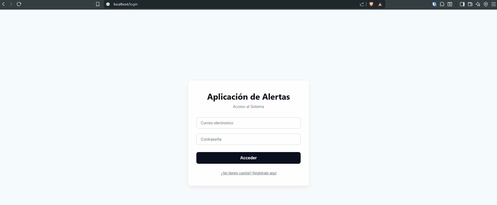
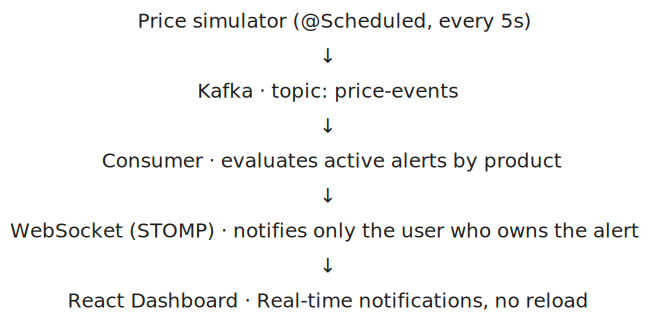
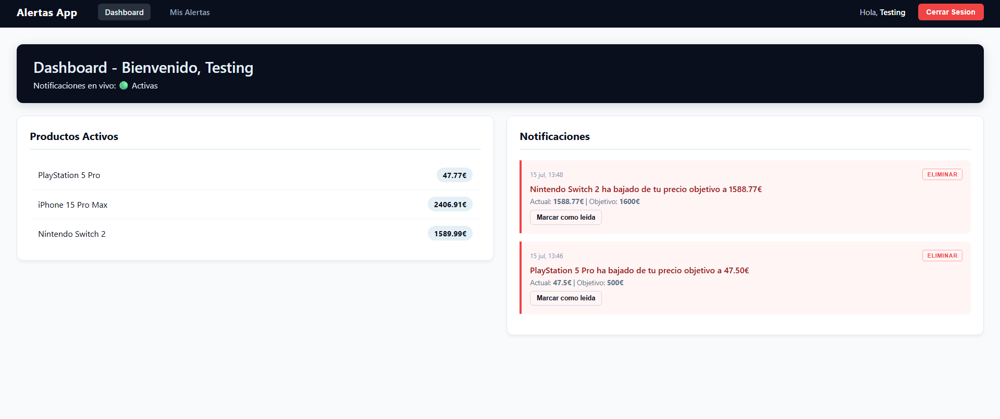
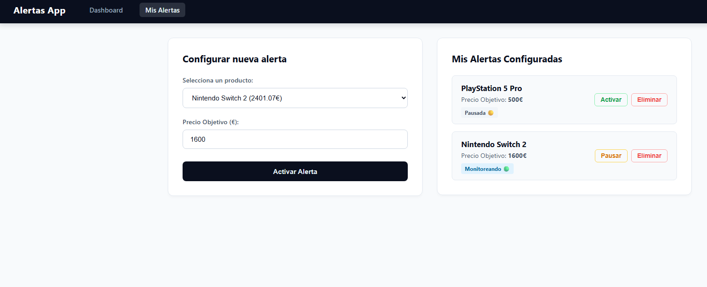
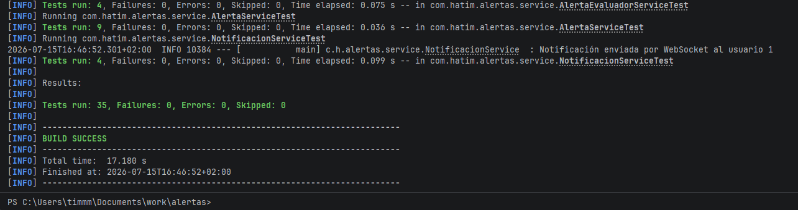
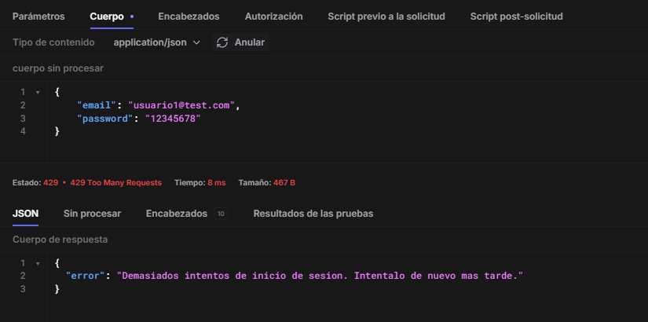
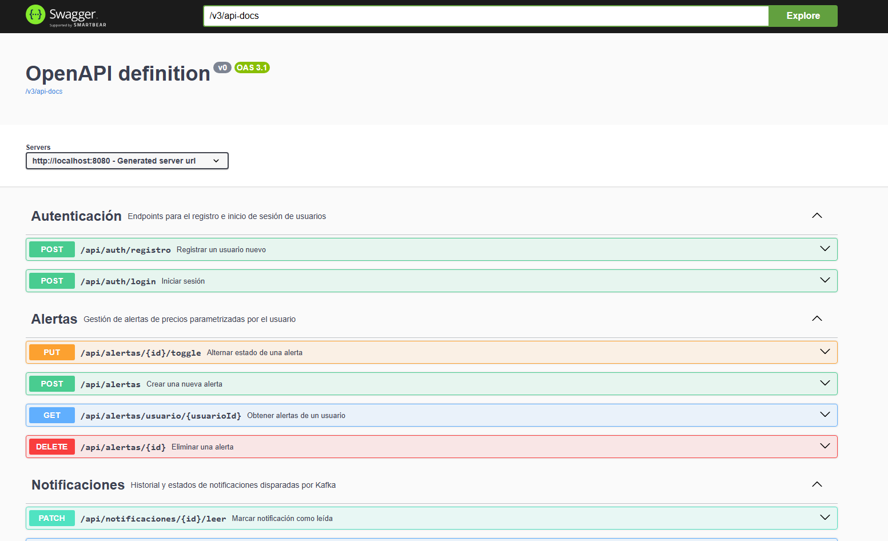
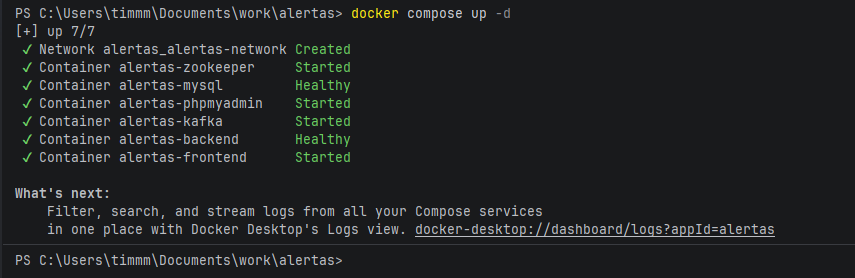

🇬🇧 English (you are here) | 🇪🇸 [Leer en Español](README.es.md)

---

# Real-Time Price Alerts System

[](https://openjdk.org/projects/jdk/21/)
[](https://spring.io/projects/spring-boot)
[](https://kafka.apache.org/)
[](https://react.dev/)
[](https://www.docker.com/)
[]()
[]()
[](https://github.com/DebHatim/alertas-tiempo-real/actions/workflows/ci.yml)

A platform where users set custom alerts on products and get real-time notifications when the price drops below their
target. Event-driven architecture with Apache Kafka at its core, stateless JWT authentication, and push notifications
over WebSocket.

---

## Demo



*Creating an alert, then watching the notification arrive live over
WebSocket the moment the simulated price drops below target, no page
refresh.*

## Architecture



Authentication: login issues a signed JWT (HS256) that the frontend attaches to every request. A filter (
`JwtAuthenticationFilter`) validates the token and exposes the authenticated user's id to the controllers. Alert and
notification routes check that the requested resource belongs to the user in the token, not the id passed in the URL.

## Stack

| Layer          | Technology                                                              |
|----------------|-------------------------------------------------------------------------|
| Backend        | Java 21 · Spring Boot 3.5                                               |
| Messaging      | Apache Kafka · Zookeeper                                                |
| Security       | Spring Security 6 · JWT (JJWT) · BCrypt · Rate limiting (Bucket4j)      |
| Persistence    | JPA/Hibernate · MySQL 8                                                 |
| Real-time      | WebSocket · STOMP · SockJS                                              |
| API Docs       | springdoc-openapi (Swagger UI)                                          |
| Observability  | Spring Boot Actuator (health checks)                                    |
| Frontend       | React 19 · React Router · Axios                                         |
| Infrastructure | Docker Compose (MySQL, Kafka, Zookeeper, backend, frontend, phpMyAdmin) |
| Build          | Maven · Lombok                                                          |

## Features

- Registration and login with JWT, passwords hashed with BCrypt
- Resource-level authorization: each user can only view/modify their own
  alerts and notifications
- Rate limiting on the login endpoint to mitigate brute-force attempts
- Alert management by product and target price (create, pause/resume, delete)
- Price simulator with random variation every 5 seconds
- Real-time alert evaluation via Kafka consumer
- Instant dashboard notifications over WebSocket, with option to mark as read
- Per-user notification history
- Interactive API documentation via Swagger UI
- Health check endpoint used by Docker Compose to gate service startup order
- Public landing page + login/registration flow separate from the private area

## Screenshots

<table>
  <tr>
    <td width="50%">
      
      <p align="center"><em>Dashboard: active products and real-time notification feed</em></p>
    </td>
    <td width="50%">
      
      <p align="center"><em>Alerts page: create, pause/resume, and delete price alerts</em></p>
    </td>
  </tr>
</table>

## Design decisions

**Why Kafka instead of a direct call between services?**
Decoupling lets the simulator and the evaluator evolve independently. If the
evaluator goes down, events queue up in Kafka and get processed once it's
back, with no data loss.

**Why WebSocket instead of polling?**
Polling would require the client to ask every X seconds whether there are new
notifications, generating unnecessary load. WebSocket keeps an open
connection and the server pushes notifications the exact moment they happen.

**Why JWT instead of sessions?**
The backend is fully stateless: no session stored in memory or in the
database, which makes horizontal scaling easier and fits naturally with a
deployment where frontend and backend run in separate containers.

**Why does an alert deactivate once triggered?**
Same as well-known price trackers (Keepa, CamelCamelCamel): an alert
represents a one-time target. Once it's met, it's marked as completed
instead of notifying in a loop. The user can reactivate it with one click if
they want to keep watching the same product.

**Why rate limit only the login endpoint?**
It's the highest-value target for credential stuffing and brute-force
attempts against user accounts. Bucket4j caps repeated attempts per IP
without adding overhead to the rest of the API.

## Running it locally

**Only requirement:** Docker installed.

```bash
git clone https://github.com/DebHatim/alertas-tiempo-real.git
cd alertas-tiempo-real
docker compose up -d
```

That single command spins up MySQL, Zookeeper, Kafka, the Spring Boot
backend, and the frontend. No need to install Java, Maven, Node, or
configure databases by hand.

- Frontend: `http://localhost`
- Backend API: `http://localhost:8080/api`
- Swagger UI: `http://localhost:8080/swagger-ui.html`
- Backend health check: `http://localhost:8080/actuator/health`
- phpMyAdmin (optional, inspect the DB): `http://localhost:8081`

> MySQL runs without a password and phpMyAdmin with arbitrary access, a
> configuration meant only for local development, not for a deployment
> exposed to the internet.

<details>
<summary>Backend development without Docker (optional)</summary>

If you want to iterate directly on the backend with Maven, you need Java 21,
Maven, and a running Kafka + MySQL 8 instance on your own (you can spin up
just those two with `docker compose up -d mysql kafka zookeeper`).

```bash
./mvnw spring-boot:run
```

And for the frontend:

```bash
cd frontend-alertas
npm install
npm run dev
```

Relevant environment variables: `KAFKA_SERVERS`, `DB_URL`, `DB_USERNAME`,
`DB_PASSWORD`, `APP_CORS_ALLOWED_ORIGIN` (backend) and `VITE_API_URL`
(frontend, build-time).
</details>

## Testing

Full coverage with **JUnit 5 + Mockito** over the business logic, no external
infrastructure required (no need for Kafka or MySQL running):

- `AlertaServiceTest` - alert creation, listing by user, and ownership checks
  when pausing/deleting (including the case of a user attempting to modify
  an alert that isn't theirs)
- `AlertaEvaluadorServiceTest` - Kafka consumer logic and alert triggering
  against target prices
- `NotificacionServiceTest` - real-time alert dispatch: history persistence,
  read/ownership validation, and reactive delivery via WebSocket
- Controller layer tests for `AlertaController`, `NotificacionController`,
  `AuthController`, and `ProductoController`

```bash
./mvnw test
```

Every push to `main` and every pull request runs the full suite via GitHub
Actions.

<details>
<summary>Technical captures</summary>
<br>

<table>
  <tr>
    <td style="width: 33%">
      
      <p align="center"><em>Full test suite passing locally</em></p>
    </td>
    <td style="width: 33%">
      
      <p align="center"><em>Rate limiting returning 429 after repeated login attempts</em></p>
    </td>
    <td style="width: 33%">
      
      <p align="center"><em>API documented and explorable via Swagger UI</em></p>
    </td>
  </tr>
  <tr>
    <td colspan="3">
      
      <p align="center"><em>Full stack spinning up with a single <code>docker compose up -d</code></em></p>
    </td>
  </tr>
</table>

</details>

## Roadmap

- Production deployment on a DigitalOcean Droplet, the only
  remaining step to close this project.

## Author

**Hatim Debboun** · [LinkedIn](https://linkedin.com/in/hatimdebboun) · [GitHub](https://github.com/DebHatim)